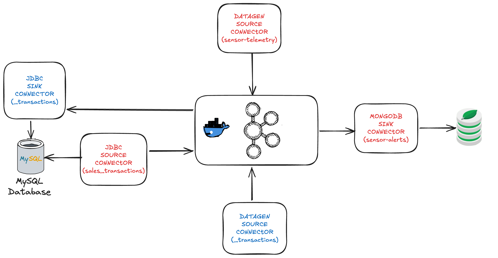

# Tarea

El objetivo de esta carpeta es facilitar el desarrollo de la tarea.

## Organización

La carpeta se organiza en los directorios

- **datagen**: contiene los schemas de los dos datasets de FarmIA (*.avsc)

- **connectors**: contiene los ficheros de configuración de los conectores a desarrollar (*.json)

- **sql**: contiene el DDL de la tabla transactions (NO MODIFICAR)

- **src**: contiene la estructura del proyecto en caso de utilizar Kafka Streams 

## Setup

El siguiente script automatiza algunos de los pasos necesarios para preparar el entorno
para desarrollar la tarea.

1. Inicia el entorno.
2. Crea la tabla transactions.
3. Instala los plugins de los conectores.
4. Copia los drivers JDBC para MySQL.
5. Copia los schemas AVRO dentro del contenedor de connect.

Se recomienda al alumno ver el contenido del fichero

```shell
./setup.sh
```

## Kafka Connect

Con el fin de simular un escenario real y crear interactividad en la tabla de transacciones se proporcionan un par de conectores para cargar la tabla transactions de forma continua.



Los conectores proporcionados (en azul) hacen uso del topic **_transactions** para cargar la tabla **sales_transactions** en la bd MySQL

- source-datagen-_transactions: Genera transacciones que cumplen el schema requerido

- sink-mysql-_transactions: Escribe las transacciones en la tabla de base de datos 

El alumno es responsable de crear (en rojo) los dos conectores en rojo:

- source-datagen-sensor-telemetry [DatagenSource](https://github.com/confluentinc/kafka-connect-datagen/blob/master/README.md#configuration) 

- source-mysql-sales_transactions [JDBCSource](https://docs.confluent.io/kafka-connectors/jdbc/current/source-connector/overview.html)

- sink-mondgodb-sensor_alerts [MongoDBSink](https://www.mongodb.com/docs/kafka-connector/current/sink-connector/)

**NOTA**

Explorar el **modo incremental** para el conector JDBCSource utilizando la columna timestamp

Para poder hacer el procesamiento posterior es **importante** que los registros generados por ambos conectores lleven el campo **key** informado.
En alguno de los conectores pueden requerir aplicar SMTs (Simple Message Transformations)

De igual modo, se proporciona un script para automatizar la ejecución de todos los conectores:

```shell
./start_connectors.sh
```

**NOTA**

Los conectores a desarrollar por el alumno están comentados en el script start_connectors. Descomentar una vez desarrollados y ejecutar para iniciarlos

## Kafka Streams / KSQLDB / Flink

A completar por el alumno usando la tecnología que prefiera.

## Shutdown

El siguiente script permite detener completamente el entorno

```shell
./shutdown.sh
```